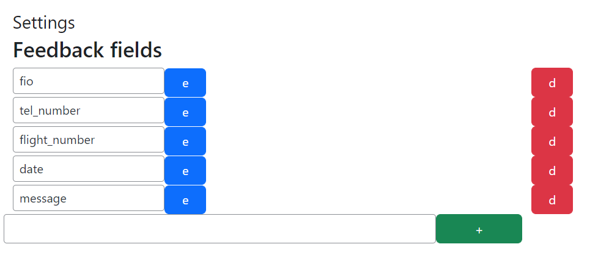
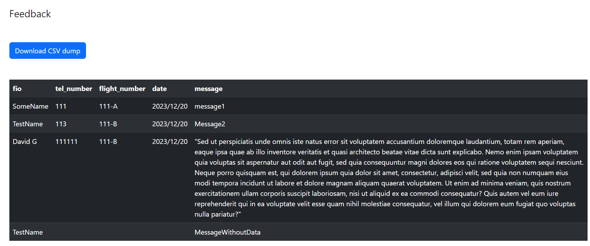

# Feedback composer

A plugin for Wordpress that allows you to comfortably collect user feedback and interact with it.

**Fully customizable**

Functions currently available:

- Fields customization
- Automatic creation of not existing fields in DB
- Feedback table view, inside admin page
- Feedback CSV dumps

# How does this plugin work?

At first, you need to visit setting page and configure needed columns names for your feedback form



But don't worry, if you forget to add some fields, or misspelled them - they gonna be automatic added to the DB, and you will be able to edit them as well on settings page

Next, you need to add the feedback form to your site, you can just copy code below...

```html
<form action=" <?php echo home_url().'/add_feedback'; ?>" method="post" style="padding-top:10px">
    <input style="width:100%;padding:5px;padding-left:40px;height:45px;" type="text" placeholder="Your placeholder for the input" name="data[name of the feedback column]">
    <textarea style="width:100%;padding:5px;padding-left:40px;height:105px;margin-top:10px;" type="text" placeholder="Your placeholder for the input" name="data[name of the feedback column]"></textarea>
    
    <?php echo wp_nonce_field( 'add_feedback', 'wifly_feedback_nonce' ) ?> 
    <input type="hidden" name="action" value="add_feedback">
    
    <button type="submit" style="    width: 70%; padding: 5px; height: 48px; margin-top: 10px; font-size: 20px; color: #003864; margin: auto; display: block;">Send feedback</button>
</form>
```

You can create as many input fields as you want!

After user submits new feedback it will be available on feedback page, inside your admin panel. Also you can download a dump with all the feedback in CSV file, simply clicking on the corresponded button



